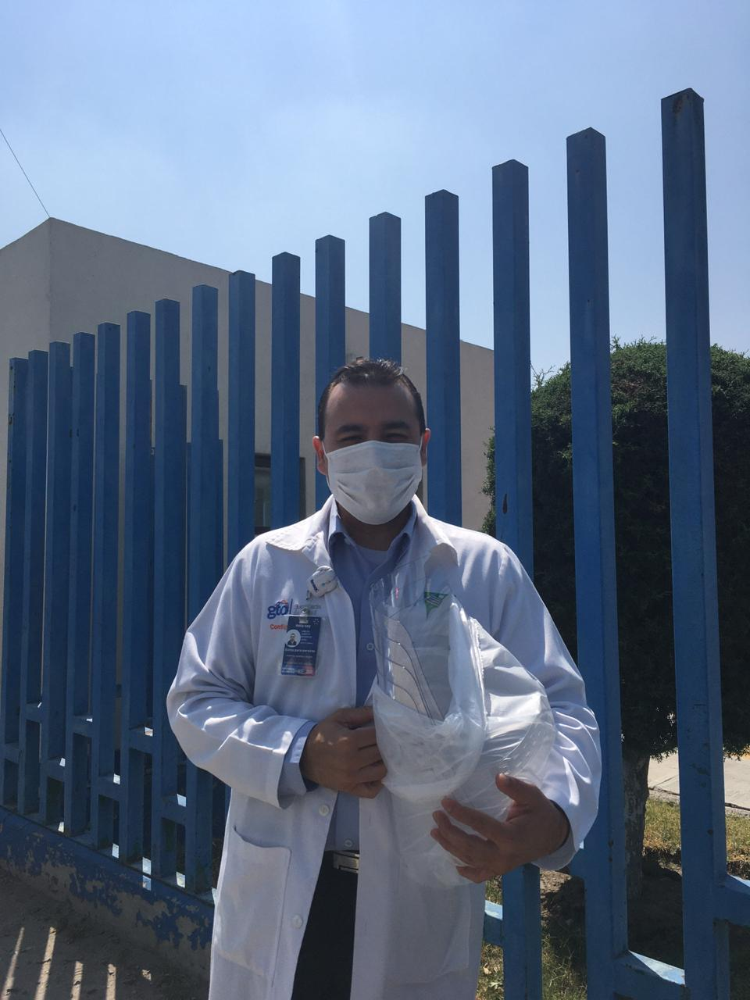

# [Instituto Politécnico Nacional](https://www.ipn.mx/)
# [CICATA Querétaro](https://www.cicataqro.ipn.mx/cq/qro/Paginas/index.html) 

# Cronología en la Construcción de Equipo de Protección Personal (EPP)

A continuación describimos algunos de los sucesos relevantes durante el periodo en el que el Instituto Politécnico Nacional, en sus instalaciones en Querétaro, estuvo construyendo EPP para la comunidad médica.

## Marzo 25, 2020
En Marzo 25 del 2020, Dagoberto Pulido, estudiante de doctorado del Instituto Politécnico
Nacional (IPN), me comunicó que en el Hospital Materno de Celaya querían conseguir cajas tipo “aerosolbox” para protegerse durante las operaciones de intubación de pacientes enfermos de COVID-19. Al parecer, estas cajas fueron desarrolladas por [Lai Hsien-yung](https://sites.google.com/view/aerosolbox/design), un anestesiologísta en Taiwan. Durante el proceso de intubación, hay un grupo  médico que atiende al paciente. El paciente reacciona al proceso de intubación tosiendo, tratando naturalmente de expeler el instrumento que es introducido a su garganta.   
Las cajas están hechas de acrílico trasparente de 3mm de grosor. Las cajas tienen dos paredes sin material, una por donde entra el paciente, y otra debajo de la cual el paciente está recostado. Por otra de las paredes, se tienen dos orificos en donde entran las manos de quien realiza el procedimiento. El diseño con algunas paredes abiertas y otras cerradas, obedece a la necesidad de reducir la exposición de las personas que están realizando el procedimiento. 

## Marzo 26, 2020
Hacia el 26 de Marzo, fuimos a comprar material, al tiempo que David Medina, estudiante de Maestría ponía a punto el diseño de Hsien-yung para poder utilizarlo. En tanto, Othón González, recién egresado del doctorado, ponía a punto el cortador láser de nuestro [FabLab en  el IPN](https://www.fablabs.io/labs/SALLAB). Pronto comenzaron a surgir más peticiones en el Hospital General del ISSSTE en Querétaro, el Hospital Materno Infantil de Querétaro. El material para las cajas, que consiste en una hoja de acrílico de 127mm x 249mm, se corta en 18 minutos, y de él salen tres cajas, pero el ensamblaje que es manual, tarda una hora para cada caja. En adición, el pegado tarda 24 horas para alcanzar su máxima resistencia. 

 

*Fig. 1: Primer prototipo de Caja Aerosolbox.*

 

El mismo día 26 de Marzo, se unió Israel Cruz, estudiante de Maestría. El preguntó sobre la necesidad que había de caretas de protección en base a Tereftlato de polietileno (PET) con la adición de glicol (PET-G). Ese mismo día, por la noche, Israel estaba modificando un diseño desarrollado en España por el grupo [Escudo COVID19](https://escudocovid19.org) y puesto a libre utilización bajo licencia
tipo CC BY-NC 4.0. En su contribución, Israél modificó el diseño para que la banda trasera de sujeción tuviera un cierre más seguro y más cómodo. En el caso de las caretas, el corte tarda 40 minutos y salén 20 por hoja de PETG de 127mm x 249 mm. 

## Marzo 27, 2020
Para el 27 de marzo, las primeras cajas aerosolbox estaban listas para ser validadas por los médicos. Omar Montoya, estudiante de Doctorado, y Mayra Cándido, estudiante de Maestría, y Regina Hernández, profesora del IPN, se incorporarón al grupo. 

*Fig. 2: Validación de la caja tipo Aerosolbox.*

 
 

Ese mismo día, las primeras caretas comenzaron a producirse. Hacia medio día acudimos al Hospital del Niño y la Mujer. Nos recomendaron hacer una modificación a las cajas. La idea era hacer una rampa en la tapa superior, de tal forma de permitir al intubador acercarse lo más posible al paciente. Igualmente, el tamaño de los agujeros quedo reducido a 12 cm de diámetro. Este mismo día hicimos modificaciones al diseño de las caretas, para quedar en actual estado.  

## Marzo 28, 2020
Por la mañana del 28 de Marzo recibimos a Arturo Gómez, investigador del CIDESI. Arturo coordina el Consorcio Mexicano de Manufactura Aditiva (CONMAD). Su intención era realizar cortes láser en material que sería utilizado para el armado de un prototipo de ventilador. A la postre, este ventilador sería tomado por CONACYT, junto con otros cinco diseñados en otros lugares, para elaborar productos nacionales. En particular, el ventilador de CIDESI terminó fabricado por la empresa [Safrán](https://elceo.com/tecnologia/mabe-safran-y-dydetec-colaboran-con-conacyt-para-fabricar-700-ventiladores-en-mexico/). 
El mismo 28 de Marzo acudimos al Hospital General del ISSSTE en Queretaro para realizar pruebas de validación con médicos.

*Fig. 3: Validación de la caja tipo Aerosolbox en adultos. Diseño con rampa.*

*Fig. 4: Validación de la caja tipo Aerosolbox pediátrica. Diseño con rampa.*

 

 

Presentamos dos caretas a los médicos, una de ellas las que habiamos elaborado en el IPN. El personal seleccionó estas caretas porque no tenían elástico, el cual se degradaba con el lavado y perdía flexibilidad. En adición, el otro modelo requería impresión 3D, lo cual lo hacía más tardado y caro de producir. La CONMAD decidió validar nuestros modelos de careta y caja como aptos para la tarea de protección de personal médico. Con los EPP validados, procedimos a realizar su producción en serie. También con los diseños validados instalamos una página en [github](https://github.com/CICATA/covid19) para distribuir los diseños ampliamente y de forma gratuita.

*Fig. 5: Validación de la careta.*

 
 

## Marzo 29, 2020
El 29 de Marzo comenzamos a distribuir en el Hospital General de Querétaro (HGQ). A través de la noche habían tenido su primer paciente de COVID-19. Cuando llegamos estaba  el cuerpo médico y enfermeras reunidas en el patio con el Director General. El estaba explicando los procedimiento y resolviendo dudas. Fue muy emotivo que justo en ese momento donde se respiraba tensión e incertidumbre apareciera la camioneta del IPN con EPP. 

*Fig. 6: Reunión en el HGQ después del primer fallecido por COVID19 en Querétaro.*

Esa primera entrega incluyó caretas y cajas aerosolbox.

*Fig. 7: Primera entrega de material al HGQ.*
 

 

Más tarde, también levamos cajas y caretas a la Delegación del IMSS, donde fuimos recibidos por su delegada. También estuvieron muy contentos de recibir el apoyo del IPN. De esta forma comenzamos con estas acciones una relación con la delegación IMSS que se ha manifestado en acciones como elaboración de programas de cómputo para la elaboración de sus informes y el análisis de sus datos para la predicción de los resultados a la prueba molecular de reacción en cadena de polimerasa de transcripción inversa cuantitativa (qRT-PCR).

*Fig. 8: Primera entrega de material al IMSS.*

 

Las fichas técnicas de  las caretas y los cajas aerosolbox terminaron de elaborarse. Ambas fueron aprobadas por la CONMAD. 

## Marzo 30, 2020
El 30 de Marzo continuamos produciendo y repartiendo material en el Hospital General de Celaya, el Hospital Materno-Infantil de Celaya, el Hospital del Niño y la Mujer en Querétaro, el ISSSTE de Querétaro. Nos llegaron peticiones de ayuda  de Tijuana, Mérida, León, Jalpán, la CDMX y Celaya.  Comenzaron a llegar gente de la sociedad civil a las instalaciones del IPN buscando ayudar. Por la tarde, el Diputado Federal Felipe Macías visitó las instalaciones del IPN y grabó [un video](https://www.facebook.com/961310490582166/posts/2873303376049525/?vh=e&d=n) que difundió en redes sociales.  

Estos eran días de mucha tensión, con noticias que se sucedían a gran velocidad. El Gobernador de Querétaro anunció que se había enfermado. Uno de los estudiantes de nuestro prosgrado se había enfermado al trasladarse a guardar cuarentena en Morelos. Afortunadamente, solo presentó síntomas leves y pudo afrontar la enfermedad desde casa. La febril actividad en la que estabamos envueltos nos hacía notar que habíamos tocado una fibra muy sensible en la sociedad, principalmente mostrado en la atención que estabamos generando.  

*Fig. 9: Armado de cajas en el IPN*

 

 

Estabamos apoyando a los médicas, enfermeros, paramédicos y camilleros preparandolos para el trabajo que a algunos pronto les tocaría enfrentar y otras ya estaban enfrentado. El personal médico está en la linea de combate y nosotros les estabamos ayudando a que estuvieran más protegidos. Mi sentir en ese momento es que estabamos haciendo algo fundamental. Los días eran largos pero estaban valiendo la pena. En esos momentos teniamos los diseños y la experiencia en la construcción de cajas y caretas que nos permitiran atender cierta demanda, pero más importante, estabamos siendo una semilla importante en la creacion, difusión y adopción de material médico de protección de personal. 

Samuel Salas, estudiante de la UNAM, se incorpora al grupo.  

*Fig. 10: Entrega de cajas aerosolbox al IMSS.*

 
 

## Marzo 31, 2020
El 31 de Marzo entregamos 10 cajas tipo aerosolbox al HGQ, y 5 (cinco} más al IMSS.

*Fig. 11: Entrega de cajas aerosolbox al Director General del HGQ.*

 

La dirección de hospitales de los Servicios de Salud del Estado de Querétaro (SESEQ) nos reconocía la labor que realizabamos y nos enviaba el agradecimiento del Gobierno del Estado. Al tiempo nos solicitaba equipo para los municipios de Jalpan y Cadereyta, en la forma de caretas y cajas aerosolbox para niños y adultos. 

*Fig. 12: Entrega de caretas a la Administradora del HGQ.*

## Abril 1, 2020

Nos solicitaron material para el hospital de la mujer en la CDMX. Las personas estaban dipuestas a venir por el material a Querétaro. Una primera persona falleció en las instalaciones del IMSS en Querétaro, un trabajador de salud. Entregamos material en el HGQ. Recibimos una petición del IMSS de Mérida. Recibimos respaldo institucional para continuar elaborando material.  
Debido al incremento en la intensidad de la crisis y las nuevas acciones de gobierno del estado para prevenir su difusión, a partir de este día redujimos la permanencia de personas en las instalaciones y comenzamos a armar caretas en casas. 
La caja de aerosolbox tuvo una modificación propuesta por David Medina que facilitaba su armado. 

Daniela Basurto, estudiante de Maestría, se incorporó al grupo.

## Abril 2, 2020
Se optimizaban los diseños para acomodar más caretas por hoja de PETG, hasta llegar a 20.
Nuestro trabajo fue parte del apoyo que ofrecio el [IPN al Gobierno Federal] (https://www.ipn.mx/CCS/comunicados/ver-comunicado.html?y=2020&n=52&fbclid=IwAR19DqPimXV4bgBnXloVQrgDjjK56JV87Le2g-gPr7Be410JXFZfndC0K1A)

Nos anuncian que Mabe ha comenzado la producción y distribución de cajas tipo [aerosolbox a nivel industrial](https://www.expoknews.com/ante-la-pandemia-de-covid-19-desarrollan-equipo-protector-para-personal-medico-con-cajones-de-refrigerador/). Su sistema de producción es mediante termoformado. Por ello, comenzamos a enfocar nuestros esfuerzos en la producción de caretas.

## Abril 3, 2020
Regina Hernández preparó soluciones sanitizantes, en base a cluroruo benzalconio al 0.18%,  en atomizador. Estas fueron entregadas en el hospital general del ISSSTE.

*Fig. 13: Entrega de sanitizantes en el Hospital General del ISSSTE.*
 

Nos anuncian que Innovet, un fabricante industrial comenzaba a producir caretas. Incluso José Jiménez, su propietario tuvo la gentileza de visitarnos en las instalaciones del IPN.  Su precio de producción era menor que el nuestro por casi un 40% y su capacidad de producción unos dos ordenes de magnitud mayor. Ese primer diseño de sus caretas introducian cierta deformación óptica y se empañaban, pero eran económicas  y potencialmente podrían estar disponibles en grandes cantidades. Nos sentimos contentos de su reconocimiento de que había comenzado a elaborar diseños y prototipos a raíz de enterarse de nuestra actividad y evaluar que su empresa podía contribuir a satisfacer la demanda del mercado. 

## Abril 4, 2020
El gobernador de Querétaro llama a la población a quedarse en casa. Entregamos las cajas y caretas restantes y mandamos armar a casas las caretas que hasta ese momento habíamos fabricado. Con el anuncio del gobernador y la entrada de productores industriales, decido pedir a a los estudiantes que procedieramos a guardar cuarentena y concluir con las actividades de producción de EPP.  

## Abril 6, 2020
Nos llegan noticias de nuestras caretas siendo utilizadas en el hospital de Oncología Siglo XXI del IMSS. Durante el día llegan más testimonioss de nuestro material siendo utilizado por médic@s y enfermer@s. El [comunicado c-058 del IPN](https://www.ipn.mx/assets/files/ccs/docs/comunicados/2020/04/c-058.pdf) da testimonio de nuestra contribución al esfuerzo institucional.

*Fig. 14: Usuarios del EPP construido*

 

*Fig. 15: Usuarios del EPP construido*

*Fig. 16: Usuarios del EPP construido*

*Fig. 17: Usuarios del EPP construido*

  

## Abril 20, 2020
El Diario de Querétaro sumariza nuestra colaboración en un [reportaje visual](https://www.facebook.com/212232811807/posts/10159140925676808/)

## Material Entregado
A continuación detallamos la cantidad de equipo entregado, la fecha de la entrega y el destinatario. Todo el material fue entregado gratuitamente.

|Fecha | Aerosolbox Adulto | Aerosolbox Pediátrico | Destino |
| ------------- | ------------- |------------- |------------- |
|2020.03.27|	1|		|H-NyM|			
|2020.03.29|	1|	1	|HGQ|		
|2020.03.30|	2|		|IMSS-Del-Qro|		
|2020.03.31|	9|	10	|H-NyM|
|2020.03.31|	10|		|IMSS-Del-Qro|
|2020.03.31|	6|	2	|H-NyM|
|2020.03.31|	10|		|HGQ|			
|2020.04.02|	5|		|HGJ|		
|2020.04.03|	1|		|IMSS-UMF16|
|2020.04.04|	1|	2	|SESEQ|
|2020.04.04|	4|		|IMSS-Del-Qro|
|TOTAL|	50|		15| |

|Fecha | Caretas |  Destino |
| ------------ | ------------- |------------- |
|2020.03.28|	4|	CS|
|2020.03.29|	30|	IMSS-Del-Qro|
|2020.03.29|	30|	HGC, ISSSTE, H-NyM|
|2020.03.30|	16|	HGQ|
|2020.03.30|	4|	HGJ|
|2020.03.31|	53|	HGQ|
|2020.03.31|	10|	H-NyM|		
|2020.04.01|	30|	IMSS-Del-Qro|
|2020.04.01|	53|	HGQ|
|2020.04.02|	8|	HGJ|
|2020.04.02|	2|	EJR	|	
|2020.04.04|	136|	SESEQ|		
|2020.04.05|	90|	SESEQ|
|2020.04.06|	105|	IMSS-Del-Qro|
|2020.04.06|	106|	HGQ|
|TOTAL|	677	

+ H-NyM,	Hospital del Niño y la Mujer
+ IMSS-Del-Qro,	IMSS delegación Querétaro
+ HGQ,	Hospital General de Querétaro
+ SESEQ,	Secretaría de Salud del Estado de Querétaro
+ IMSS-UMF-16,	IMSS Unidad Médico Familar #16
+ CS,	Centro de Salud San Pedrito Peñuelas
+ HGJ,	Hospital General de Jalpán
+ EJR,	Epidemiología de la Jurisdicción Regional4
+ HGC,	Hospital General de Celaya

## Conclusión
La comunidad del IPN puede sentirse orgullosa del esfuerzo que este grupo de estudiantes y profesores hicieron a favor de la comunidad médica. El efecto más grande fue en el estado de Querétaro, pero hubo oportunidad de apoyar a hospitales otros lugares de la república. Los diseños fueron colocados en internet para una adopción más amplia. Siento que nuestra aportación fue ayudar a encender la chispa para que otro makers, universidades, y eventualmente empresarios se dieran cuenta de la necesidad que había de apoyar. Entramos cuando las cosas no se podían comprar porque no existian. Salimos cuando había mostrada capacidad industrial para satisfacer la necesidad con un menor gasto.

*Fig. 18: Entrega de caretas en Guanajuato.

 

 
# Participantes
Este trabajo ha sido fruto del esfuerzo colaborativo y voluntario de muchas personas. Entre ellas se encuentran:

Daniela Basurto 
Omar Montoya 
Mayra Candido 
Israel Cruz  
Othón González 
Regina Hernández 
David Medina 
Juan Alejandro Pulido 
Maria Ivone Paniagua 
Dagoberto Pulido 
Raúl Rodea 
Joaquín Salas 
Samuel Salas 

 

*Fig. 19: La Técnica al Servicio de la Patria*

## Agradecimientos
Los gastos asociados a la producción de EPP fueron cubiertos por un donativo de la Fundacion Politécnica, los recursos del Instituto Politécnico Nacional, y la generosa participación de estudiantes, profesores, y personas de la sociedad civil, a quienes les quedamos 
muy agradecidos.

## Para mayor información: 

Instituto Politécnico Nacional 
Cerro Blanco 141, Colinas del Cimatario  
Querétaro, 76090, México 
jsalasr@ipn.mx o salas@ieee.org 
Joaquín Salas

